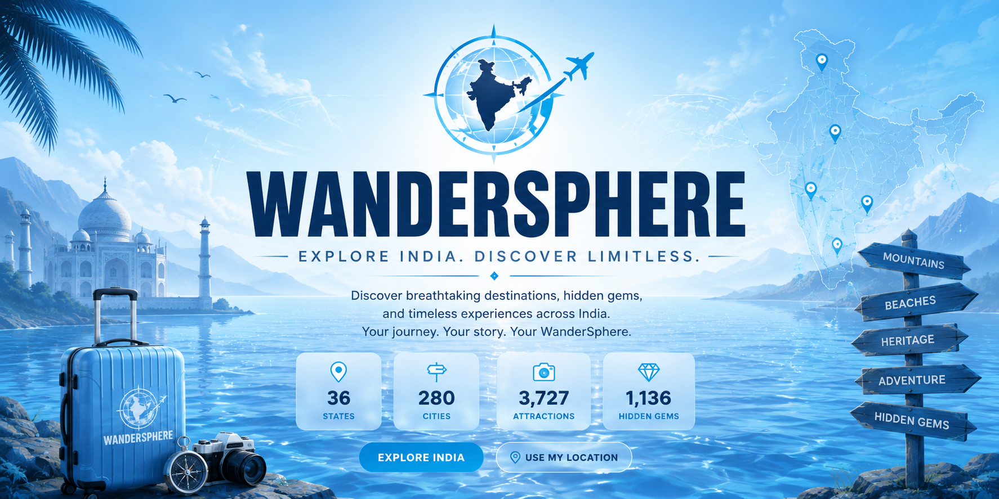

<p align="center">
  
</p>

<h1 align="center"> WanderSphere 🌊 </h1>

<p align="center">
A modern <b>Full-Stack India Travel & Tourism Website</b> featuring intelligent destination discovery, personalized itinerary planning, hidden gems exploration, Supabase authentication, dynamic travel data, and a responsive premium user experience.
</p>

<p align="center">


</p>

---

# 🚀 Live Website

### 🌐 https://wandersphere-purple.vercel.app/

---

# 📖 About

WanderSphere is a modern full-stack India travel and tourism website designed to provide travelers with an immersive digital experience for discovering destinations across India.

The website allows users to explore Indian states, cities, attractions, hidden gems, nearby destinations, weather information, interactive maps, and personalized travel itineraries.

The platform also includes user authentication, saved trips, wishlist management, itinerary generation, downloadable itinerary PDFs, and a responsive ocean-inspired interface designed around a modern glassmorphism experience.

---

# ✨ Features

- 🌊 Immersive Ocean WebGL Background
- 🇮🇳 India Travel & Tourism Discovery
- 🗺️ Interactive Destination Exploration
- 📍 State, City & Attraction Discovery
- 💎 Hidden Gems Exploration
- 📌 Nearby Destination Discovery
- 🌤️ Live Weather Information
- 🔎 Destination Search
- 🗺️ Interactive Map
- ✈️ Personalized Travel Itinerary Planning
- 📅 Day-by-Day Trip Planning
- 💾 Saved Trips Management
- ❤️ Wishlist Management
- 📄 Downloadable Itinerary PDF
- 👤 User Profile Management
- 🔐 Supabase Authentication
- 🌓 Day/Night Theme
- 📱 Fully Responsive Design
- ⚡ Fast & Interactive UI
- 🖥️ Production Deployment on Vercel

---

# 🛠 Tech Stack

| Technology | Usage |
|------------|------|
| Next.js | Full-Stack Web Framework |
| React | User Interface |
| TypeScript | Type-Safe Development |
| CSS | Styling & Responsive Design |
| Supabase | Authentication & Backend |
| PostgreSQL | Application Database |
| OpenWeather | Weather Information |
| Pexels | Destination Photography |
| WebGL | Interactive Ocean Background |
| Vercel | Deployment & Hosting |

---

# 📂 Project Structure

```text
WanderSphere/
│
├── public/
│   ├── images/
│   ├── banner.png
│   ├── favicon.ico
│   └── ...
│
├── src/
│   ├── app/
│   │   ├── api/
│   │   │   └── search/
│   │   ├── auth/
│   │   ├── city/
│   │   │   └── [id]/
│   │   ├── dashboard/
│   │   ├── itinerary/
│   │   ├── map/
│   │   ├── place/
│   │   │   └── [id]/
│   │   ├── profile/
│   │   ├── globals.css
│   │   ├── layout.tsx
│   │   └── page.tsx
│   │
│   ├── components/
│   │   ├── sections/
│   │   ├── ui/
│   │   └── ...
│   │
│   ├── data/
│   ├── hooks/
│   ├── lib/
│   ├── store/
│   ├── styles/
│   ├── types/
│   └── middleware.ts
│
├── .env.example
├── .gitignore
├── next.config.js
├── package.json
├── package-lock.json
├── postcss.config.js
├── tailwind.config.js
├── tsconfig.json
└── README.md

```text
```
# 🎯 Key Highlights

✅ Full-Stack India Travel & Tourism Website

✅ Modern Next.js & React Architecture

✅ India State, City & Attraction Dataset

✅ Hidden Gems Discovery System

✅ Personalized Travel Itinerary Planner

✅ Interactive Map & Destination Exploration

✅ Supabase Authentication

✅ Saved Trips & Wishlist Management

✅ Live Weather Information

✅ Pexels Destination Photography

✅ Downloadable Itinerary PDF

✅ Responsive Mobile & Desktop UI

✅ Ocean WebGL Background

✅ Day/Night Theme Experience

✅ Modern Glassmorphism UI/UX Design

✅ Vercel Production Deployment

# 👨‍💻 Developed By

Mathu Bharathi A

Biomedical Engineer • Full Stack Developer • Graphic Designer

# 📄 License

This project is developed for WanderSphere and portfolio purposes.

© 2026 WanderSphere. All Rights Reserved.
